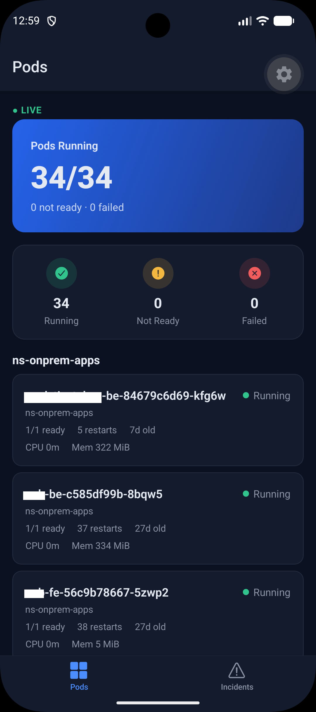
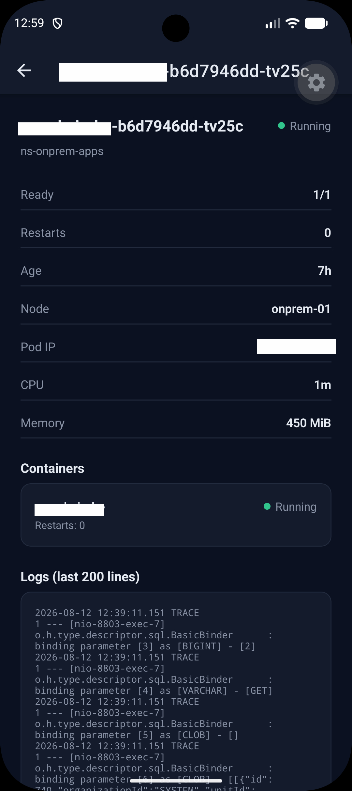
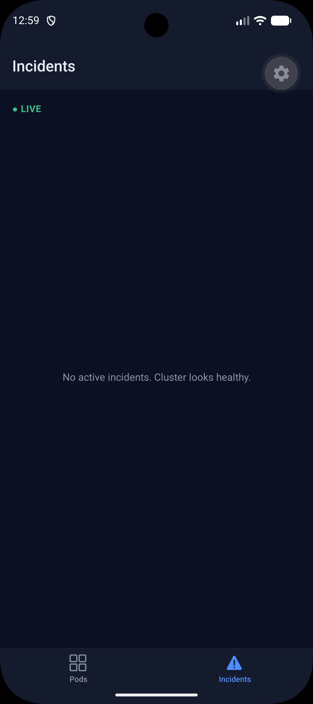
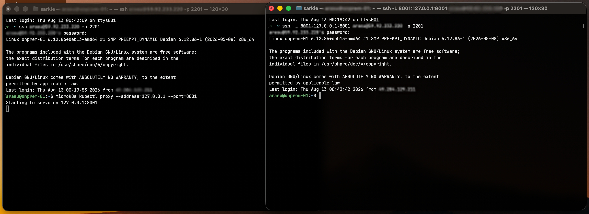

# Pulse — Kubernetes Production Incident Monitor

A React Native (Expo) app that monitors a real production Kubernetes namespace,
**read-only** — pod health, live logs, and automatically detected incidents (crash
loops, image pull failures, OOM kills, sustained high CPU/memory) — backed by a small
Node.js service that talks to the cluster's API and streams updates over WebSocket.

Started as a React Native learning project (component architecture, hooks, navigation,
offline-first caching, WebSocket reconnection) and evolved into a genuine, read-only
monitor of a real MicroK8s production cluster.

## Screenshots

| Pods dashboard | Pod detail + live logs |
|---|---|
|  |  |

| Pods list | Incidents (healthy cluster) |
|---|---|
|  |  |

## What it does

- **Live pod inventory** for a namespace: status, readiness, restart count, age, node
  placement, CPU/memory usage.
- **Automatic incident detection** from real cluster state — no manual thresholds to
  babysit:
  - **Critical**: pod failed, `CrashLoopBackOff`, `ImagePullBackOff`, `OOMKilled`
  - **High**: pod not ready, container restart count increased
  - **Medium**: CPU or memory sustained ≥80% of the pod's own limit for 3 consecutive
    checks (a single spike never triggers an incident)
- **Live pod logs**, pulled straight from the cluster.
- **Realtime backend pipeline**: a Kubernetes watch stream drives instant pod-status
  updates; a separate poll handles CPU/memory (the metrics API can't be watched);
  everything broadcasts over the app's existing WebSocket connection.
- **Offline-first mobile client**: cached last-known state, pull-to-refresh, automatic
  reconnection with backoff, clear loading/error/empty states throughout.

## Architecture

```
React Native (Expo)
      │  REST + WebSocket
      ▼
Node.js backend  ──────────────►  Kubernetes API  ──────────────►  MicroK8s
(this repo's server/)             (via kubectl proxy,                (production)
                                    reached over an SSH tunnel —
                                    never exposed publicly)
```

The backend never talks to Kubernetes directly, and never shells out to SSH per request.
`kubectl proxy` runs on the cluster's server, bound to loopback only; an SSH tunnel
forwards a local port to it. The Node backend just does plain HTTP `fetch()` calls
against that tunneled local port — no Kubernetes credentials of any kind live in this
codebase.

**Every Kubernetes API call is a read (`GET`).** There is no code path anywhere in this
repository that can create, patch, delete, scale, or exec into anything in the cluster.



## Tech stack

- **Mobile**: React Native, Expo (SDK 57), TypeScript, React Navigation, native
  `WebSocket`, `AsyncStorage`, `expo-linear-gradient`, `@expo/vector-icons`
- **Backend**: Node.js, Express, `ws` — talking to the Kubernetes HTTP API directly (no
  Kubernetes client SDK)

## Project structure

```
pulse/
├── mobile/    React Native app (Expo, TypeScript)
└── server/
    └── src/
        ├── data.js       fictional demo data generator (original learning project)
        ├── index.js      Express + WebSocket server
        └── k8s/          the real Kubernetes integration layer
            ├── client.js       read-only HTTP calls via kubectl proxy
            ├── normalize.js    raw Kubernetes objects → this app's own types
            ├── incidents.js    incident detection rules
            ├── realtime.js     watch stream + metrics poll → WebSocket broadcast
            └── routes.js       REST endpoints
```

## Getting started

### Prerequisites
- Node.js 18+
- Expo CLI (`npx expo`) and either an Android emulator, iOS simulator, or the Expo Go
  app on a physical device
- Access to a Kubernetes cluster (optional — the app also runs against the built-in
  fictional demo data with no setup at all)

### Backend
```bash
cd server
npm install
npm start
```
Runs on `http://localhost:4000` (REST + WebSocket at `/ws`).

### Mobile
```bash
cd mobile
npm install
npx expo start
```

### Connecting to a real Kubernetes cluster (optional)

The Kubernetes integration expects the cluster's API reachable at
`http://localhost:8001`, via a manually-started tunnel — this is never automated, by
design:

**On the Kubernetes host:**
```bash
kubectl proxy --address=127.0.0.1 --port=8001
# or, for MicroK8s specifically:
microk8s kubectl proxy --address=127.0.0.1 --port=8001
```

**On your local machine:**
```bash
ssh -L 8001:127.0.0.1:8001 <user>@<host> -p <port>
```

Once both are running, the backend's `/api/pods`, `/api/overview`, `/api/events`, and
`/api/pods/:namespace/:name/logs` endpoints start returning real cluster data — no
restart needed. Configure the target namespace via the `K8S_NAMESPACE` environment
variable (defaults to `ns-onprem-apps`).

Without the tunnel, the Kubernetes-backed endpoints simply return a `502` with a clear
error; the rest of the app (the original fictional demo data) is unaffected.
